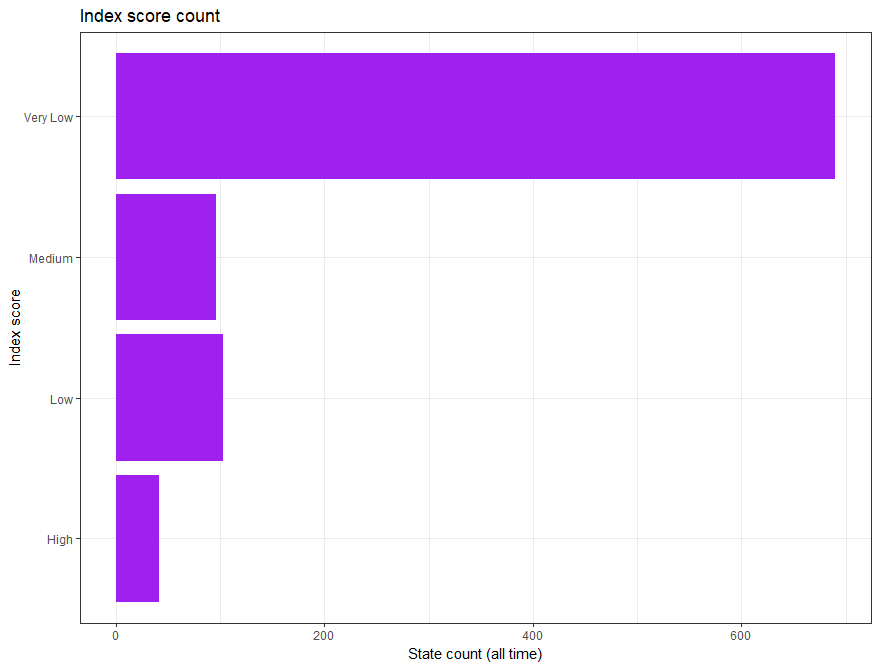
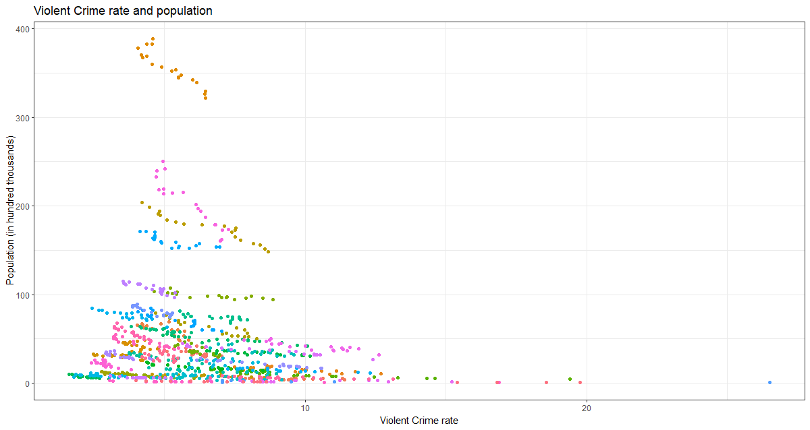
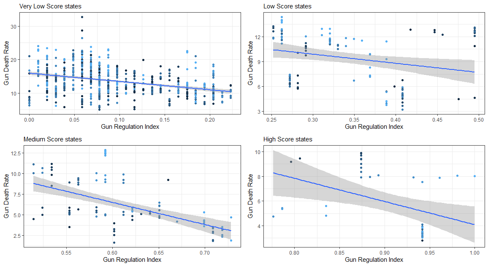
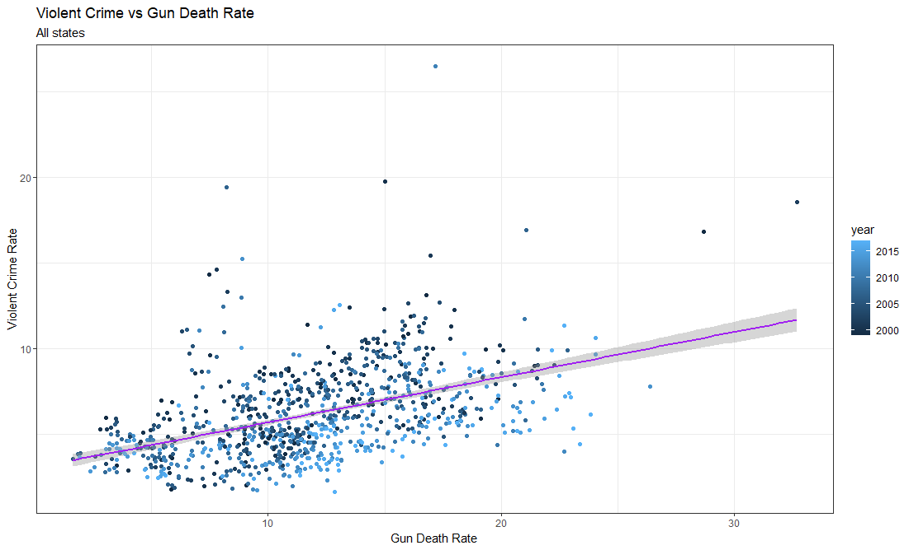

   *Abstract*--- 
    The aim of this paper is to provde a summary analysis of the data regarding the effectiveness of gunrestriction policy in diminishing the numberof gun-related deaths. We do so by conducting an analysis of three different datasets, and by combining the data we gathered from them, and constructing a linear regression model. The constructed linear regression model shows a negative correlation between the gun-related death rate and the amount of legislation present within the state. This suggests that it's possible for legislation to have a positive effect on gun-related deaths.


# Introduction

The topic of gun regulation has been discussed at length in the United States of America, because of the real and present danger that it poses to Public Safety. There's little doubt that policy has potential to have a substantial effect, and information coming from data analysis can be useful in supporting the decision making. The aim of this paper is to conduct a summmary analysis of the correlation between overall presence of gun restriction and the rate of deaths caused by guns.

## Paper overview

In this paper, we analysed data coming from three different datasets: one is a collection of all gun restiction laws that have been put in place by individual states, the second is a collection of gun deaths by county. The third trakcs violent crime rates.

The scope of the paper is national, and we aim to obtain valuable information by comparing the performance of different states within the same country: we expect the cultural differences to be (even if still present) less impactful than they would be in a inter-country comparison, and thus hope to be able to eliminate most untraceable biases that would arise from it.

To reach our conclusions, we conducted an analysis of the 3 datasets, using them as follows:
- From the first dataset, we extracted an index to answer the question 'how much regulation around guns is present in this state?'
- From the second dataset, we extracted aggregated data by year and by state regarding deaths and rates of death by guns.
- From the third dataset, we extracted information about the change in violent crime rates over time, to be able to set up a multiple linear regression model.

Overall, we found a negative correlation between the gun provision index and the gun death rate, even when accounting for the changes in violent crime.

# Methods

## Preparing the Datasets

### Dataset 1

The first dataset is comprised of informations regarding deaths by guns divided by county, but our analysis takes place at the state level. Therefore, the dataset was grouped by state and we removed superfluous variables like county code, state code and state initials.

Additionally all of our datasets contain data compiled at different points in time so the information was filtered to retain only the years overlapping across all three datasets, the nineteen years from 1999 to 2017.

The preparation was done in the following way:
```r
gundeaths_cut <- gun_deaths_us_1999_2019[-c(1, 3:5, 7)]
gundeaths_cut <- subset(gundeaths_cut, !gundeaths_cut$Year > 2017)
gundeaths_cut <- gundeaths_cut[-c(5:10)]
gundeaths_cond <- gundeaths_cut %>%
    group_by(across(where(is.character))) %>%
    summarise(across(where(is.numeric), sum, na.rm = T), .groups = "drop")
```
We then constructed a simple rate, balanced over 100,000 people, to provide for the different populations between states.
```r
gundeaths_cond$Rate <- 0
for (i in 1:nrow(gundeaths_cond)) {
    gundeaths_cond$Rate[i] <- ((gundeaths_cond$Deaths[i] / gundeaths_cond$Population[i]) * 100000)
}
```
The the final form of the dataset was:

| **Year** | **State** | **Deaths** | **Population** | **Rate**  |
| -------- | --------- | ---------- | -------------- | --------- |
| 1999     | Alabama   | 605        | 3047241        | 19.854025 |
| ...      | ...       | ...        | ...            | ...       |

### Dataset 2

The second dataset contains all of the laws restricting gun usage for each US state, represented by 133 binary variables.
Aside from filtering for the correct years a Index (referred to as "Gun Regulation Index" from here on) was constructed usin min-max normalization.
```r
law_provision_norm <- subset(law_provision_norm, !law_provision_norm$year < 1999)
proc_lawprov <- preProcess(as.data.frame
(law_provision_norm$lawtotal),
    method = c("range"))
law_provision_norm$index <- predict(proc_lawprov, as.data.frame(law_provision_norm$lawtotal))
```
To account for differences, states were given scores, "Very Low" "Low" "Medium" "High", according to their Gun Regulation Index.
```r
merged$Score <- ifelse(unlist(merged$index) <0.25, "Very Low",ifelse(unlist(merged$index) <0.5, "Low", ifelse(unlist(merged$index) <0.75, "Medium","High")))
```
Final product:

| **Year** | **State** | **Law Total** | **Index**   | **Score** |
| -------- | --------- | ------------- | ----------- | --------- |
| 1999     | Alabama   | 16            | 0.126213592 | Very Low  |
| ...      | ...       | ...           | ...         | ...       |

### Dataset 3

The third dataset, mainly added for multiple linear regression purposes in an attempt to account for Omittted Variable Bias, contains the raw numbers of different types of crimes committed in each state. To keep the data as closely related to guns as possible, and to make sure there was no instance of double counting (it wasn't made clear what of the specific crimes listed counted as a 'Violent Crime') we just included "Violent Crimes".
```r
estimatedcrimes_cut <-  subset(estimated_crimes, estimated_crimes$year >= 1999)
estimatedcrimes_cut <-  subset(estimatedcrimes_cut, estimatedcrimes_cut$year <= 2017)
estimatedcrimes_cut <-  subset(estimatedcrimes_cut, !estimatedcrimes_cut$state_name == "District of Columbia")
estimatedcrimes_cut <-  subset(estimatedcrimes_cut, !estimatedcrimes_cut$state_name == "")
estimatedcrimes_cut <-  estimatedcrimes_cut[-c(2,4,6:15)]
```
A Violent crime rate was then constructed, balanced on thousands of people.
```r
estimatedcrimes_cut$VCrime_Rate = 0
for (i in 1:nrow(expl_merge)) {
  expl_merge$VCrime_Rate[i]<- ((expl_merge$violent_crime[i] / expl_merge$Population[i]) * 1000)}
```
The data obtained was formatted in the following way:

| **Year** | **State** | **Violent Crimes** | **VCrime Rate** |
| -------- | --------- | ------------------ | --------------- |
| 1999     | Alabama   | 21421              | 7.029638        |
| ...      | ...       | ...                | ...             |

## Descriptive Analysis

### Dataset 1

The Gun Deaths dataset shows the average deaths per year to be 515.34, with a standard deviation of 605.09 (this is not a typo, it's a quirk of the average spanning across several years), the death rate instead has an average of 11.90% and a standard deviation of 4.67%, these descriptive statistics, although weak alone, show a variance of considerabe size.


.png)


The graphs show the variance and its evolution over time.

To aid visualization we also constructed a histogram representing the
death count for each state


### Dataset 2

For the law provision dataset the mean of the law total is 24.92, with a
standard deviation of 23.60, instead the mean of the Gun Regualtion
Index is 0.21, with a standard deviation of 0.23, again showing a big
variance in our data.


As is easily interpretable, most of the states kept a very low index for the time period analyzed in this study, but there are instances of some states, for example the state of California, keeping very high Index values across the whole time period. This wide gap was not a surprise, as the difference of positions of prominent political figures in the respective states are pretty representative of their -be it high or low- index score.

.png)

In order to understand the importance of the division of the states in accordance to their scores, it's important to visualize the position of the US states, as the differences will become very apparent.



This bar chart represents the scores of all the US states across our 19 year time period, and it's pretty easy to say that seeing these discrepancies also shaped our future analyisis and prompted us towards conducting it by keeping track at all times of each state's score.

### Dataset 3

The third dataset, the one containing the information about violent crimes in the US presents itself in an analogous way to the previous datasets.
The mean of the violent crimes is 26976.7 per year, with a standard deviation of 34431.64 (again, this is also not a typo. See previous footnote), while the mean of the violent crime rate is 6.18%, with a standard deviation of 2.62%

Once again, a high variance is observable across all of our data, again suggesting the importance of a criteria of distinction (in our case the index score) in the state-level analysis to capture efficiently correlations and statistically useful results.




## Explorative Analysis

Having established the nature and characteristics of the three datasets, we now proceed to conduct an analysis of the combination of their data. The aim of this analysis is to establish the impact (or lack there of) of legislation on gun death rates. In order to do so, we first seek to check for the presence of correlation, and then formulate a linear regression model. We then will try to integrate data from possibly correlated variables in an attempt to remove omitted variable bias, and thus create a multiple linear regression model.

The explorative analysis began by plotting and calculating the mean gun death rate (by 100,000) over time, and comparing it with the mean Gun Regulation index over time.


At a first glance just by looking at the graphs side to side may lead us to think that even if the Gun Regulation Index has been rising over time the Deaths by guns still don'show any signs of decreasing, but a closer inspection reveals that the Gun Regulation Index over nineteen years has only increased by a meager 0.04% and to discern a pattern we need to go deeper and look for substantial causal effects.

By calulating the Pearson correlation between the Gun Regulation Index and the gun death rate we're returned with a value -0.624, suggesting a non-negligible negative correlation between them


By plotting them in the same graph the negative correlation becomes obvious, but we can also notice the skewedness of observations towards the low values of the Gun Regulation Index, so in accordance to our prior suggestion we split the observations in accordance with their own Index score bracket and run the same analysis.
 
By splitting the observations we get a clearer image: the -0.624 correlation isn't consistent across all states, but the pattern can still be observed.

The correlations for each groups are as follows:
- Very low score states = -0.375
- Low score states = -0.254
- Medium score states = -0.555
- High score states = -0.4123633

Here we also begin to see the signs of a pattern repeating also in the next steps: Medium score countries tend to have the highest correlation among all of the groups.

Now, after setting up a linear model, we obtained the results of an intercept equal to 14.63 and the index coefficient equal to -12.65.

This number may seem absurdly big, but during the interpretation it is useful to remember that our index is normalised. So, while an increase of 1 would result in very high differences in value, normal increases are in the order of magnitute of 0.1, thus making the data immediately appear more reasonable.

To supplement the current model with regards to the general unreliability and susceptibility to outliers of linear regression, and the possible presence of omitted variable bias, we decided to aid our analysis with the inclusion of the third dataset, with the aim of constructing some additional linear models and useful plots.

 
Before cimenting ourselves into the actual model building, we included the evolution of the mean violent crime rate over time and, once again an immediate analysis may lead us to think that as the Gun Regulation Index increased the violent crime rate decreased, and this is also supported by the correlation between them (-0.293), and their plot.

But we very quickly found out that this plot is actually very misleading, and the analysis on subset of states havin similar score is more interesting.
 
Now that the plots are much clearer, while our pattern in the sheer size of the negative correlation between our values in medium score states is visible to the naked eye, we can also observe some instances of positive correlations in some of the following cases:
- Very low score states = -0.0596
- Low score states =  0.403
- Medium score states =  -0.654
- High score states = 0.229

While the social interpretation of these findings is out of the scope of this study without claiming anythin we can still infer that the data shows that increasing the Gun Regulation Index has some dubious effects in relation with the Violent Crime Rate, we can still interpret that Violent Crime is not a simple enough issue that can be fixed just by increasing Gun Control.

Building a linear model emphasizes this finding since it returned us a value of 6.896 for the intercept and of -3.335 for our Gun Regulation Index.
 
Now, we may also be interested in the relationship between gun deaths and the violent crime rate, so we calculated once again the correlation between them and obtained a value of 0.471, showing that indeed they are correlated.



Now,to understand relationships on a deeper level, we once again divided the states in accordance to their score.


In this case we can observe that all of our brackets contain some level of positive correlation, in particular:
- Very low score states = 0.371
- Low score states =  0.285
- Medium score states = 0.685
- High  score states = 0.239


As anticipated before, medium score states continue to stand out in their high correlations with the studied subjects, but once again the interpretation is out of the scope of this paper.
Some further analysis could lead to the underlying motives of the pattern, maybe trough the identification of some omitted characteristics common to the medium scored countries which point towards this particular outcome, or through the analysis of the immediate effects of increasing the Gun Regulation Index, understanding the mechanisms that shape them in differently scored states.


By building a linear model we're met with the following results:
a value of 3.029 for the intercept and  0.264 for the Death Rate coefficient, showing a surprisingly low coefficient, but understandable, since the Death Rate is balanced over 100.000 people.

For the final passage of our study we culminated the research by trying to draw some conclusions making use of multiple linear regression in an attempt to fix eventual mistakes made with the usage of linear regression, in other words by adding the Violent Crime rate we try to solve some of the omitted variable bias that could have tampered with our data.

With the construction of the Multiple linear regression model we obtained the values of:  10.755 for the intercept,  -10.775 for the coefficient of our Gun Regulation Index and 0.563 for the coefficient of the violent crime rate.

Even if the coefficient of the violent crime rate returned pretty small values, since also the intercept and the coefficient for Gun Regulation got smaller means that we achieved our aim of covering some of the unexplained variance.

We then plot these results in a 3d interactive plot (available for download in the GitHub repository for this study and #link("https://soliprems.web.app/gd_gr_vc_3dplot.html", "here")), that due to the limitations of pdfs (and skill issues in the web version) can be relayed here only in the form of an image.


<!--  -->
<!--  -->
<!---->
# Conclusions

The relationship that emerges from the data is clear, even if not perfectly consistent: there's a negative correlation between our gun provision index and the gun death rate. This correlation gets weaker with the introduction of violent crime rates as a regressor in the linear regression model, but it remains negative on the whole (although it becomes positive in the case of low and high score states. It's worth noting that they're a much smaller sample than the very low score states, which remains negative. This is visible by the total remaining overall negative).\
While the policy analysis is complicated, this would seem to suggest that it's possible, although obviously not guaranteed, to write legislation that aims and achieves and improvement in the number of gun-related deaths.

## Future work

The work could benefit with an expansion in a few areas:

-   Integration of more variables that might be correlated with the gun
    death rate in order to escapoe possibleomitted variable bias

-   analysis of the effectiveness in relation to the intentionality
    behind gun deaths: what kind of deaths does gun control prevent?

# Appendix

The full script and project contents are freely available [here](https://github.com/soliprem/statistics-project) under the GPL_v3 license.

## Contributions

### Francesco Prem Solidoro

Contributed to the writing of the code, to the search and reformatting
of the datasets, to the writing of the document (in particular:
abstract, conclusions) and management of the tooling used for the
project (github, git, typst.app, firebase)

### Michele Salvi

Contributed to the writing of the code, to the search and reformatting
of the datasets, and to the writing of the document (in particular:
methodology, sections A, B and C)

### Juan Calani
Contributed to the idealization of the project, organization, and provided a reiview of the work.

### Elena Rocco
Contributed to the idealization of the project, organization, and provided a reiview of the work.
