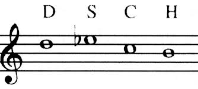

## Introduzione

Nelle scienze politiche, esiste una visione delle interazioni sociali
che presenta quest'ultime come una serie di 'giochi'. In questi, ci sono
tre possibili azioni che un partecipante messo in condizione di disagio
da un'azione o situazione può scegliere di prendere: 'Voice', 'Loyalty',
o 'Exit'. Mentre Loyalty ed Exit sono molto autoesplicativi
(corrispondono infatti all'adattarsi per convivere con la situazione, o
uscirne interamente), voice è più interessante. Voice prevede infatti la
possibilità di **protestare**, e quindi manifestare il proprio fastidio,
nella speranza di ottenere un cambiamento favorevole.\
Uno degli elementi fondamentali del mito di Sisifo, nell'interpretazione
assurdista, è la perseveranza vista come manifestazione della Protesta.
Si attribuisce quindi in quest'ottica un valore intrinseco all'atto di
protesta verso una condizione fondamentalmente assurda che va aldilà
della possibilità di una ricompensa, come nel caso della teoria dei
giochi (in cui il valore netto dell'attività 'Voice" è di fatto negativo
se non ci osno risultati tangibili).\
Dimitri Shostakovich era un compositore Sovietico durante la seconda
guerra mondiale e la guerra fredda. La sua carriera, nata nel periodo
fiorente delle avanguardie, passa attraverso il restringimento della
censura di stato, per arrivare infine nel pieno regime totalitario
stalinista, e le regole ferree che vengono introdotte sull'arte e
l'espressione personale. In questa fase della sua carriera, Dimitri
Shostakovich dimostra il suo spirito Sisifico nel sopportare la
condizione di estrema restrizione priva di speranza di uscita attraverso
una protesta muta di parole, ma certamente non di suono.

## Shostakovich, un giovane impavido

Inizialmente, Shostakovich segue il percorso delle avanguardie ancora
nel periodo iniziale della censura Stalinista. Questo si può notare nel
carattere quasi Ligetiano delle armonie nelle sue prime sinfonie, ed
opere. Imparerà presto, però, che sarebbe stato necessario trovare un
sano equilibrio fra scrivere musica che piacesse a lui, e musica che
piacesse a Stalin. Infatti, durante un'esecuzione di 'Lady Machbet" alla
quale stava assistendo Stalin in persona, quest'ultimo esce furibondo e
disgustato. Il giorno dopo, Shostakovich trova una 'recensione molto
negativa" sul giornale. Questa si conclude, a seguito di grosse critiche
sul carattere astratto, amelodico, e sgraziato della sua opera, con la
frase 'questo è un gioco che potrebbe concludersi molto male'. Vista la
velata minaccia da parte del Partito, Shostakovich inizia ad essere più
sottile nell'espressione dei propri interessi musicali devianti. Da qui
in poi, però, inizia il suo rapporto altalenante con lo stato. Questi
sono stati il primo periodo di approvazione, ed il primo periodo di
disapprovazione da parte del suo governo, ma on saranno gli ultimi.

## Shostakovich inizia a scontare la sua pena

A seguito di Lady Machbet, le opere orchestrali di Shostakovich si fanno
più sottili. maschera le critiche al partito come critiche
all'occidente, oppure nasconde i suoi esperimenti musicali, come fa ne
"l'età dell'oro" sostenendo di mettere a confronto "la degeneratezza"
dell'occidente con "il vigore sportivo" dell'unione sovietica. È chiaro
analizzando l'opera quale delle due fazioni avesse gli elementi musicali
più interessanti, tuttavia.\
Un caso emblematico di questo periodo è la Quinta. Pubblicata
accompagnata da una nota che la descriveva come "la risposta creativa di
un artista sovietico ad una critica giustificata", è considerata un
successo dal partito, che la sente in linea con l'estetica sovietica, ma
anche dal pubblico, che la percepisce come un grido di rabbia e dolore
in risposta alla censura.\
Un caso analogo è la Settima, scritta durante l'assedio di Leningrado da
parte dei nazisti. La sinfonia viene ricevuta dal partito con
sufficiente calore da fare escogitare all'esercito nazista un piano per
interromperne la prima. Il partito la vede come una celebrazione delle
vittorie militari dell'unione, ed una critica sferrata al regime
nazista. Shostakovich rileva che non si tratta di una critica
indirizzata solo ai nazisti ma 'anche al nostro sistema', o meglio, a
tutti i totalitarismi.

### La musica da camera

Mentre la musica orchestrale era sotto strettissimo scrutinio, nello
scrivere musica da camera, Shostakovich poteva sentirsi più libero. È
qui che si vedono le sperimentazioni più grandi, e che si snte la voce
cruda e ruvida del compositore. È qui che, nel piccolo della musica da
camera, Shostakovich Protesta le ingiustizie che percepisce nel mondo.
nel 1944, quando iniziano a sentirsi voci dell'Olocausto che stava
avvenendo in Germania; Shostakovich nello stesso periodo perde un caro
amico, che per caso o per destino è ebreo. L'autore quindi, già solito
includere passaggi in Frigia dominante, (in Yiddish, *Freygish*.
Figura 1) compone un trio di pianoforte d'archi in
cui essa compare straziata, portata all'estremo del grottesco. Questa,
rivela a corrispondenti, è una critica non solo all'antisemitismo della
Geramania nazista, ma anche all'antisemitismo in Russia, che sopprime
anch'essa la cultura ebraica in questo periodo storico.

*Figura 1. scala frigia dominante*

Dichiarazioni di questo tipo non sono insolite per
Shostakovich. Soprattutto nella musica da camera, non è insolito che
riversi una parte delle sue sofferenze nella forma di una composizione.
Questo è chiaramente visibile in composizioni come l'ottavo quartetto
d'archi, pensato da molti essere scritto inizialmente come una lettera
di suicidio.\
Questo viene detto perchè all'interno del quartetto si trovano
riferimenti a tutti i suoi temi più grandi, perchè una delle "idee"
principali è la sua firma (che usa frequentemente nelle sue
composizioni, ma non in questa quantità. Figura 2). In
questa composizione ritorna il tema straziato del matrimonio ebraico,
vengono ripresi temi dalle sue opere sinfoniche, da Lady Machbet, e dei
suoi quartetti precedenti, ed idee da varie sue composizioni.\

*Figura 2. Il tema **D**imitri **S**hostakovi**CH** (in notazione tedesca), firma di Shostakovich che inserisce in molte composizioni*

Personalmente, sono dell'idea che il quartetto d'archi non sia
semplicemente una lettera di suicidio, ma una lettera di salvezza: un
grande atto di Ribellione che riassuma quella che ha intessuto nelle sue
composizioni nell'arco della sua vita, che in modo sisifico lo riporta
dall'orlo del baratro in cui si trovava, pronto a ripartire.

## Magnum Opus

La Nona sinfonia. Il nome da solo è già evocativo: la Nona di Behetoven,
la Nona di Bruckner, la Nona di Mahler. Stalin, conoscendo bene il
potere della Nona, ed avendo recentemente vinto una guerra molto
importante (l'anno è il 1945), nota che Shostakovich ha al momento
scritto solamente 8 sinfonie. Essendosi Shostakovich tenuto nelle grazie
del partito per qualche tempo, decide di commissionare la sua Nona
sinfonia in onore della parata militare in piazza Rossa, a Mosca, che
celebra la vittoria sovietica sul regime nazista.\
Shostakovich nota l'occasione per compere il singolo più grande atto di
ribellione della sua carriera, e spingere per un'altra volta il suo
macigno finto in cima. Per assicurarsi che passi la censura,
Shostakovich scrive la sinfonia in Mi bemolle maggiore. La tonalità
dell' *Eroica* di Behetoven. Questo viene immediatamente minato da un
accordo di sol bemolle già alla quarta battuta, ma probabilmente la
tonalità è stata sufficiente a non farlo notare.\
Quello che consegna Shostakovich è un'opera leggera, spensierata,
scherzosa. Già nell'introduzione il tema degli archi ed il gioco
d'intreccio fra i fiati suggerisce un'opera scritta come sottofondo ad
una commedia. Questo è enfatizzato ulteriormente all'ingresso del
trombone, che suggerisce l'inizio di una fanfara maestosa con una
cadenza che sembra essere perfetta, ma che lascia lo spazio
immeddiatamente ad una risposta giocosa da parte dell'ottavino. Lo
spirito grottesco viene solo aumentato dalla scelta di introdurre un
ritornello alla fine dell'introduzione. Questo è un richiamo alle prime
sinfonie di Haydn, una pratica assolutamente anacronistica per una Nona
moderna. La sinfonia raggiunge l'apice del grottesco nel momento in cui
il *motif* del trombone viene ripetuto per 5 volte fuori posto, come se
il trombone avesse fretta e partisse troppo presto. Questa è una poco
sottile presa in giro dell'entusiasmo degli amanti del partito che
dimostrano nel voler essere sempre i primi a dichiarare il loro supporto
al partito, e dà un tono grottesco e francamente ridicolo all'intero
primo movimento.\
Il tono giocoso, scherzoso, ed ovviamente grottesco della sinfonia non
passa inosservato da Stalin che, in seguito all'esibizione, procede a
dare Shostakovich un richiamo ufficiale insieme a Prokofiev e
Kachaturian nel 1948. Viene dichiarato un 'nemico del popolo" e gli
vengono tolte le sue cattedre. Sarà solo dopo la morte di Stalin che
riuscirà ad uscire da questo stato di isolamento.

## Il mito di Shostakovich

Riprendendo l'inizio de 'Il mito di Sisifo" di Camus, l'unica questione
filosofica degna di considerazione è il suicidio.\
Shostakovich è, a mio avviso, una figura sisifica perchè di
alte ambizioni nella sua origine, viene lanciato in una vita di lunghi
ed incessabili tormenti. Un mondo in cui viene posto davanti all'assurda
combinazione di uno spirito creativo e di una censura stringente che gli
tarpa le ali. Di fronte a questa incompatibilità, esplora ogni aspetto
umano della sofferenza, passando dal tentativo di passare attorno alla
censura coi suoi stratagemmi (come nel caso dell'Età dell'Oro), a
semplicemente nascondere il suo estro sotto ad una maschera di
propaganda, come nella Quinta e nella Settima, a trovare sfogo nella
musica da camera, a grandi atti di ribellione come la Nona, che però
paga cari ogni volta. E quando giunge alla Questione per antonomasia,
trova conforto nella Ribellione, e giunge alla conclusione che la vita
sia degna di essere vissuta. Non penso si possa dire abbia vissuto
propriamente in modo felice, ma trovo che la sua sopravvivenza soltanto
possa rendere innegabile che se una figura mitologica nella ribellione
all'assurdo può trovare addirittura felicità, noi come Shostakovich
possiamo sperare di trovare sopportazione.
